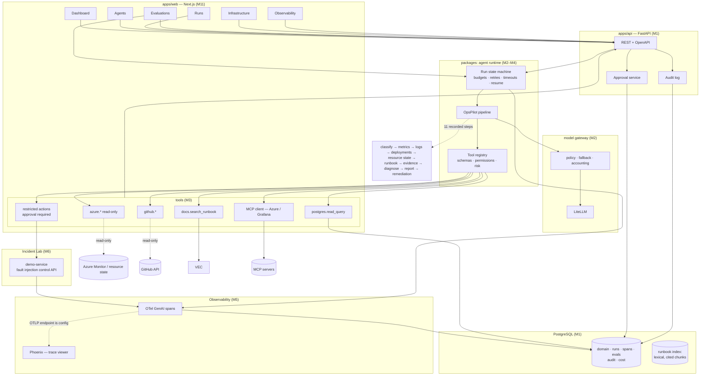

# Architecture

Phase 1 design. Components marked **(M#)** are built in that milestone; everything else is selected
open source.

## Data flow for the flagship run

1. Incident Lab injects a fault in `demo-service`; the service emits Prometheus metrics, structured
   logs and a deployment record.
2. A run is created for the OpsPilot agent with an explicit budget (max steps, max wall time, max cost).
3. The runtime executes a fixed pipeline: classify → metrics → logs → deployments → config → runbook
   retrieval → evidence assembly → diagnosis + confidence → remediation proposal.
4. Tools execute through the registry, which enforces permission class, timeout and audit. Read-only
   tools run unattended; a restricted action halts the run and creates an approval record.
5. Every step emits OTel spans, persisted to Postgres and viewable in Phoenix.
6. The run ends with a report: evidence, citations to runbook chunks, diagnosis, confidence, proposed
   remediation, cost, latency, and the audit trail.

## Boundaries that must not blur

- **Transport** (FastAPI routers) contains no agent or domain logic.
- **Agent logic** never talks to a cloud SDK directly; it goes through the tool registry.
- **Tools** are the only place infrastructure integrations live, and each declares its schema,
  permission class and timeout.
- **Retrieved content is untrusted data** — runbook text and log lines can influence a diagnosis but are
  never interpreted as instructions and never become tool arguments without schema validation.
- **Observability is not business logic**: if the trace exporter is down, runs still complete.
